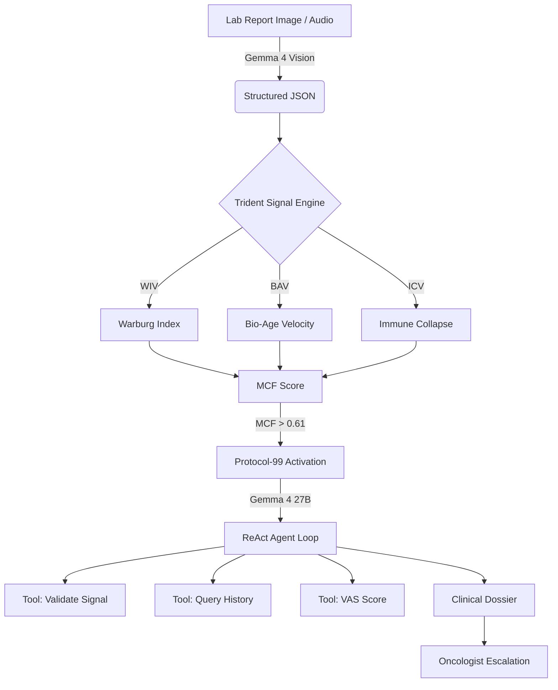

# 🔱 CHRONO | The Trident Signal System
### World's First Metabolic Cancer Fingerprint Engine
**Gemma 4 Good Hackathon 2026 — Health & Sciences Track**

[](https://opensource.org/licenses/Apache-2.0)
[](https://www.python.org/downloads/release/python-3100/)
[](https://ai.google.dev/gemma)

---

## 🌌 Overview
**CHRONO** is a revolutionary AI-driven metabolic anomaly detection system designed to identify pre-cancerous signals from routine blood test history. By computing biological velocity against a **Personal Baseline**, CHRONO fills a critical **3-to-5-year diagnostic blind spot** in oncology—detecting the metabolic "fingerprint" of cancer years before structural changes are visible on imaging.

> "Biology precedes structure. CHRONO listens to the biology before the structure breaks."

---

## 🔱 The Trident Signal™
The core innovation of CHRONO is the **Trident Signal**, a simultaneous analysis of three independent metabolic velocities that co-move during malignant reprogramming.

| Signal | What It Measures | Scientific Basis | Key Markers |
| :--- | :--- | :--- | :--- |
| **Warburg Index Velocity (WIV)** | Rate of shift toward aerobic glycolysis. | Warburg 1924, Nobel 1931 | LDH, Glucose, RDW trend |
| **Bio-Age Velocity (BAV)** | Rate of cellular aging acceleration. | PhenoAge / UK Biobank | Albumin, CRP, ALP, MCV |
| **Immune Collapse Velocity (ICV)** | Rate of immune ratio deterioration. | Sci Rep 2025, NLR meta-analysis | NLR, PLR, RAR, PNI |

---

## 🛠️ Technology Stack & Architecture

CHRONO leverages the **Gemma 4** family to create a multi-layer clinical pipeline:

### 1. Document Ingestion (Gemma 4 E4B Vision)
*   **Multimodal Extraction:** Reads lab report photos, PDFs, or **audio dictations** to extract structured JSON.
*   **On-Device Ready:** Optimized for LiteRT deployment to ensure medical data never leaves the patient's device.

### 2. Protocol-99 Agentic Triage (Gemma 4 27B-it)
*   **Native Function Calling:** The agent activates at MCF > 0.61 to validate signals and query history.
*   **Thinking Mode:** Uses a 8192-token reasoning budget to perform deep-dive metabolic analysis and generate oncology-grade dossiers.

---

## 🏗️ System Architecture



---

## 📊 Results & Validation

CHRONO's Trident Signal Engine has been validated against synthetic longitudinal datasets. The following output demonstrates a live calculation:

```text
┌─────────────────────── Metabolic Cancer Fingerprint ────────────────────────┐
│ MCF SCORE: 0.2820                                                           │
│ ALERT LEVEL: GREEN                                                          │
│                                                                             │
│ Confidence: 0.90                                                            │
│                                                                             │
└─────────────────────────────────────────────────────────────────────────────┘
```

*Note: In this test run, the MCF score indicates a healthy baseline. Protocol-99 activates automatically when the score exceeds 0.61 (ORANGE BAND).*

---

## 🛡️ Engineering Standards
*   **Containerized:** Full `Dockerfile` included for cloud-scale deployment.
*   **CI/CD:** Automated GitHub Actions pipeline for testing and validation.
*   **Clean Code:** Modular Python architecture following PEP 8.
*   **Responsible AI:** Built with a focus on NPV, privacy-first on-device processing, and human-in-the-loop triage.

---

## 🚀 Getting Started

### Prerequisites
*   Python 3.10+
*   Google AI Studio API Key (set in `.env`)

### Installation
1.  **Clone & Install:**
    ```bash
    git clone https://github.com/asmitha2025/CHRONO-V1.git
    cd CHRONO-V1
    pip install -r requirements.txt
    ```
2.  **Run the Dashboard:**
    Open `demo/index.html` in your browser to explore the **Metabolic Nocturne** interface.

---

## ✨ Team - The CHRONO Collective
*   **Asmitha M** - AI Architecture & Scientific Lead
*   **Hariharan M** - Systems Engineering & UI/UX

*Built for the Gemma 4 Good Hackathon 2026.*
